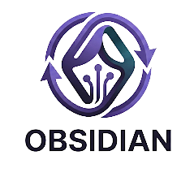
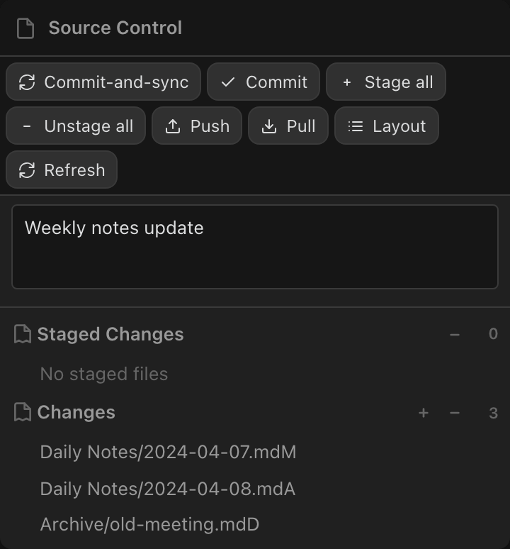
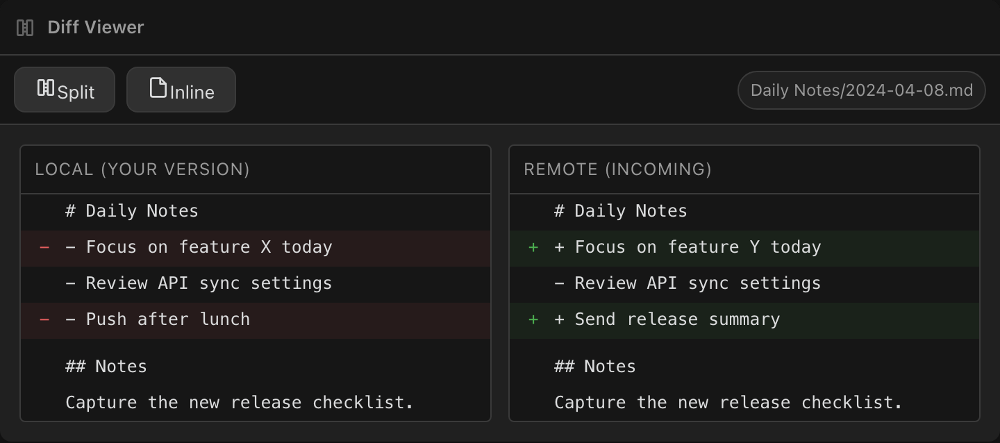
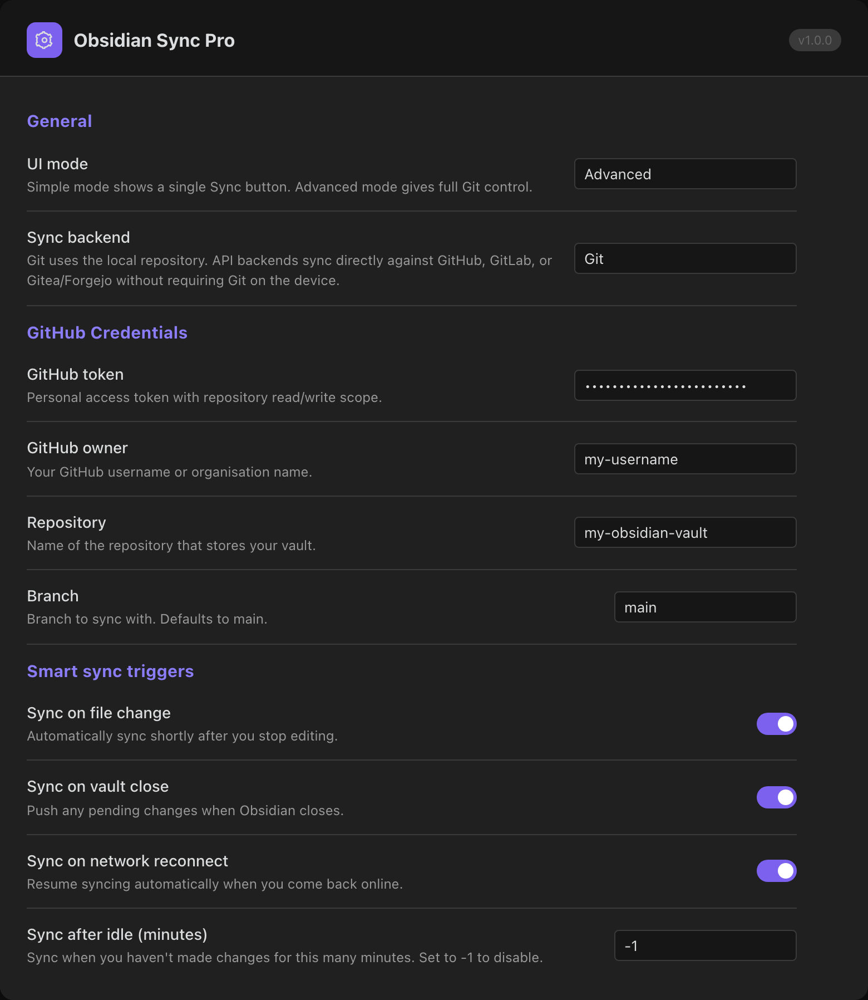

# Obsidian Git Vault

A synchronization and version control plugin for [Obsidian.md](https://obsidian.md). It supports a full Git workflow on desktop plus API-based sync backends for GitHub, GitLab, and Gitea/Forgejo that work on mobile without Git installed. Includes smart sync triggers, a visual conflict resolver, encryption for API sync contents, per-file sync metadata, and two UI modes for different workflows.

[](https://github.com/redoracle/obsidian-git-vault/releases)

[](https://github.com/redoracle/obsidian-git-vault/releases)
[](https://github.com/redoracle/obsidian-git-vault/stargazers)
[](https://github.com/redoracle/obsidian-git-vault/issues)
[](https://github.com/redoracle/obsidian-git-vault/commits/main)
[](LICENSE)
[](https://www.typescriptlang.org)
[](https://svelte.dev)
[](https://obsidian.md)
[](https://github.com/redoracle/obsidian-git-vault/pulls)
[](#-cross-platform-support)

---

## 🌟 Why Obsidian Git Vault?

| Problem                               | Solution                                                 |
| ------------------------------------- | -------------------------------------------------------- |
| Git is complex for everyday sync      | **Simple Mode** — one click, no Git terminology          |
| Mobile has no Git CLI                 | **API Sync Mode** — pure API, no binaries required       |
| Conflicts are hard to resolve         | **Visual Conflict Resolver** — side-by-side merge UI     |
| Sync is manual and easy to forget     | **Smart Triggers** — file-change, idle, close, reconnect |
| Desktop and mobile behave differently | **Hybrid Engine** — selects the right backend per device |

---

## ✨ Features

### Core Features

- ⏱ **Automatic commit, pull & push** on a configurable schedule
- 📂 **Source Control View** — stage, unstage, diff, and commit files without leaving Obsidian
- 📜 **History View** — browse commits, inspect changed files, review authors and dates
- 🔍 **Diff Viewer** — side-by-side and inline change comparison
- ✏️ **Editor Signs** — live gutter indicators for added, modified, and deleted lines _(desktop)_
- 🔗 **Submodule Support** — manage multi-repository vaults _(desktop)_
- 🌐 **Open in GitHub** — jump from any file directly to its GitHub view or history

### Pro Features

#### 🔄 API Sync Backends

Use GitHub, GitLab, or Gitea/Forgejo directly instead of the Git CLI. No installation or terminal needed. API targets are chosen through the **Use Selected Remote** workflow, which can import the selected remote into the current vault, clone it as a dedicated vault on desktop, or open an already-registered local vault when one is linked to the same repository.

#### 📱 Mobile-First Architecture

Stable sync on iOS and Android. The plugin detects mobile automatically and prefers an API backend instead of local Git.

#### ⚡ Smart Sync Triggers

Sync runs automatically based on configurable events:

- **On file change** — debounced, configurable delay
- **On app close** — no unsaved progress lost
- **On network reconnect** — catches up after going offline
- **After idle period** — syncs when you pause, not while you type

#### 🧠 Intelligent Conflict Resolution

A built-in visual conflict resolver with:

- Side-by-side local vs. remote diff
- Keep Local / Keep Remote / Edit Manually options
- Batch resolution across multiple files
- Conflict strategies: `manual` (default), `last-write-wins`, `always-local`, `always-remote`

#### 🎛 Dual UX Modes

- **Simple Mode** — one-button Sync panel, no Git terminology, live status indicator
- **Advanced Mode** — full source control UI with staging, diffing, commits, and history

#### 🔌 Extensible Backend Architecture

Built on a `SyncProvider` interface. Git, GitHub, GitLab, and Gitea/Forgejo are supported through the same sync core.

---

## 🖼 Screenshots

### Simple Mode Panel


> One-button sync, live status dot, provider badge, and conflict resolver shortcut.

#### Source Control View (Advanced Mode)



> Stage individual files or hunks, write a commit message, and push in one step.

#### Visual Conflict Resolver


> Review local and remote versions side-by-side. Keep one, edit manually, or skip.

#### History View


> Browse your full commit history, inspect changed files, and review authors.

#### Diff Viewer



> See exactly what changed in every file before committing.

#### Settings Panel (Git Vault)



> Configure sync backend, provider credentials, conflict strategy, excludes, encryption, and smart triggers from one place.

---

## 🧠 How It Works

Obsidian Git Vault uses a dual engine architecture that selects the right backend based on your platform and settings.

### Git Mode (Full Power)

Uses the native Git CLI via `simple-git` on desktop, or [isomorphic-git](https://isomorphic-git.org/) as a fallback. Gives you full commit history, branching, staging, and the standard Git workflow.

```text
Vault changes → Stage → Commit → Push → Remote (GitHub / any Git host)
                  ↑
         Pull / Fetch merges remote changes
```

### API Sync Mode (Mobile-Ready)

Communicates with GitHub, GitLab, or Gitea/Forgejo through Obsidian's built-in `requestUrl`, which has no native fetch restrictions on mobile. GitHub and GitLab use atomic commit-style writes; Gitea/Forgejo uses correctness-first per-file contents operations in the current release.

```text
Vault files ──→ Forge API (GitHub / GitLab / Gitea)
                    ↑↓
    Bidirectional diff + upload/download + metadata
```

The active engine is selected automatically based on platform, or manually in Settings.
API sync can be scoped to a single vault subfolder with **Tracked directory**, filtered further with **Excluded paths**, and optionally encrypted so only file contents are opaque on the remote.

Provider behavior in the current release:

- **Git** uses the full Git workflow and is the only backend that currently powers the History view, file-at-commit restore, submodules, and destructive history rewrite tools such as flattening a branch to one commit. The Sync Metadata sidebar does not currently expose a remote file URL for Git-backed files; the separate **Open in GitHub** command remains the Git-specific jump-to-remote feature.
- **GitHub API** supports mobile-safe bidirectional sync, per-file metadata, tracked-directory scoping, excluded paths, encrypted API sync, remote file URLs in the Sync Metadata sidebar, and atomic multi-file commit writes. The current app does not expose commit-history browsing or file-at-commit restore through this backend.
- **GitLab API** supports the same app-level sync surface as GitHub API: bidirectional sync, per-file metadata, tracked-directory scoping, excluded paths, encrypted API sync, remote file URLs in the Sync Metadata sidebar, and atomic multi-file commit writes. When GitLab is configured with a numeric project ID instead of a namespace/project path, sync still works but the Sync Metadata sidebar cannot build a browseable remote URL.
- **Gitea / Forgejo API** supports mobile-safe bidirectional sync, per-file metadata, tracked-directory scoping, excluded paths, encrypted API sync, and remote file URLs in the Sync Metadata sidebar. It currently applies per-file contents operations rather than one atomic batch commit, and the app does not expose commit-history browsing or file-at-commit restore through this backend.

All API backends also support importing the selected remote into a dedicated vault folder on desktop, auto-detect the host's default branch when the configured branch is still the placeholder `main`, and enforce a pull-first baseline after repo identity changes before any push resumes. If API encryption is enabled, the device performing the export/import must already have the matching passphrase stored locally; otherwise the clone/import is blocked before any files are written.

**Setting up encrypted sync on a new device.** When you want to import or clone a dedicated vault folder for a remote that uses API encryption, the passphrase must be stored on the new device before the import begins. File contents cannot be decrypted during download without the correct passphrase, so the plugin blocks the import rather than writing files it cannot decrypt. The recommended bootstrap workflow is:

1. Install Obsidian and Git Vault on the new device.
2. Open **Settings → Obsidian Git Vault** and configure the same provider (GitHub, GitLab, or Gitea/Forgejo) with the same owner, repository, and branch as the source vault.
3. Expand the **Encryption** section and type the shared passphrase into the **Encryption passphrase** field. The passphrase is stored in Obsidian's secret storage on this device only and is never committed to the repository.
4. Return to the provider section and use **Use Selected Remote** → choose the vault folder option. The import will now proceed because the passphrase is already available for decryption.

Share the passphrase with new devices through a trusted out-of-band channel (for example a password manager); the passphrase is never written to the repository, so there is no automated distribution mechanism.

Manual per-file **Encrypt** / **Decrypt** actions are separate from API sync encryption. They operate on the local vault file itself and are available from supported file menus regardless of sync backend.

### Supported Features

| Capability                                                              | Git                      | GitHub API                     | GitLab API                                              | Gitea API                      |
| ----------------------------------------------------------------------- | ------------------------ | ------------------------------ | ------------------------------------------------------- | ------------------------------ |
| Manual per-file Encrypt / Decrypt actions                               | Supported                | Supported                      | Supported                                               | Supported                      |
| Encrypted API sync file-content storage                                 | Not applicable           | Supported                      | Supported                                               | Supported                      |
| Tracked directory + excluded paths                                      | Not supported            | Supported                      | Supported                                               | Supported                      |
| Per-file sync metadata                                                  | Supported                | Supported                      | Supported                                               | Supported                      |
| Remote file URL in Sync Metadata view                                   | Not supported            | Supported                      | Supported when configured with a namespace/project path | Supported                      |
| Atomic multi-file remote write                                          | Supported via Git commit | Supported                      | Supported                                               | Not supported                  |
| Dedicated vault import on desktop                                       | Not supported            | Supported                      | Supported                                               | Supported                      |
| Auto-detect remote default branch for fresh / changed API target        | Not applicable           | Supported                      | Supported                                               | Supported                      |
| History view / commit log in the current app                            | Supported                | Not supported                  | Not supported                                           | Not supported                  |
| Single-file preview / restore from commit history                       | Supported                | Not supported                  | Not supported                                           | Not supported                  |
| Full repository flatten to one commit                                   | Supported                | Not supported                  | Not supported                                           | Not supported                  |
| Force-push governance enforced by hosting platform                      | Not applicable           | External branch policy applies | External branch policy applies                          | External branch policy applies |
| Automatic historical secret removal after encrypting the latest version | Not supported            | Not supported                  | Not supported                                           | Not supported                  |

---

## 🔄 Sync Modes

### Simple Mode

For users who want sync without Git terminology. Enable it in Settings → Obsidian Git Vault → UI Mode.

- One-button **Sync** action
- Live status: idle / syncing / error / conflict / offline
- Provider badge (Git, GitHub, GitLab, or Gitea)
- Conflict notification with one-click resolver
- Session sync count and last-sync timestamp

### Advanced Mode

The full Git workflow:

- Stage individual files or hunks
- Write custom commit messages
- Pull and push independently
- Browse full commit history
- Inspect per-file diffs
- Manage submodules

Both modes use the same sync engine and settings. You can switch between them at any time.

---

## 📱 Cross-Platform Support

| Feature                    | Desktop | Mobile         |
| -------------------------- | ------- | -------------- |
| Git CLI (via `simple-git`) | ✅      | ❌             |
| Isomorphic-Git fallback    | ✅      | ✅             |
| API sync backends          | ✅      | ✅ _(default)_ |
| Source Control View        | ✅      | ✅             |
| Simple Mode                | ✅      | ✅ _(default)_ |
| Advanced Mode              | ✅      | ✅             |
| Editor Signs               | ✅      | ❌             |
| Submodule Support          | ✅      | ❌             |

Mobile defaults to a direct API backend and Simple Mode. Both can be changed in Settings.

---

## ⚙️ Installation

### From Obsidian Community Plugins _(Recommended)_

1. Open Obsidian → **Settings** → **Community Plugins**
2. Disable Safe Mode if prompted
3. Click **Browse** → search `Obsidian Git Vault`
4. Click **Install** → **Enable**

### From GitHub Releases

1. Download `main.js`, `manifest.json`, and `styles.css` from the [latest release](https://github.com/redoracle/obsidian-git-vault/releases)
2. Copy them into your vault at `.obsidian/plugins/git-vault/`
3. Enable the plugin in **Settings** → **Community Plugins**

### Git Requirement

- **Desktop (Git Mode):** Git must be installed and on your `PATH`
- **Desktop (API Sync Mode):** No Git needed
- **Mobile:** No Git needed — an API backend is used automatically

---

## 🚀 Quick Start

### Beginner Path (Simple Mode + API Sync)

1. Install **Obsidian Git Vault** and enable it
2. Go to **Settings** → **Obsidian Git Vault**
3. Set **UI Mode** → `Simple`
4. Set **Sync Backend** → `GitHub API`, `GitLab API`, or `Gitea / Forgejo API`
5. Enter the matching token and repository/project details
6. Enable **Smart Triggers** as desired (e.g., sync on file change, sync on close)
7. Open the **Source Control** sidebar panel and tap **Sync**

> **Provider tokens:** GitHub, GitLab, and Gitea/Forgejo tokens are stored in Obsidian's secret storage on each device. For GitHub, go to [github.com/settings/tokens](https://github.com/settings/tokens) and generate a token with only the repository permissions you need.
>
> **Security note:** current builds store the GitHub token in Obsidian's secret storage instead of synced plugin settings. Older installs may still have written it to `.obsidian/plugins/obsidian-git-vault/data.json`, `.obsidian/plugins/git-vault/data.json`, or local storage. If those legacy copies were ever synced or backed up with a token present, rotate the token and remove it from those older locations.

### Advanced Path (Full Git Mode)

1. Install the plugin and confirm Git is installed (`git --version` in a terminal)
2. Initialize or clone a repository into your vault root
3. Go to **Settings** → **Obsidian Git Vault**
4. Set **UI Mode** → `Advanced`, **Sync Backend** → `Git`
5. Configure your commit schedule, pull on startup, and push after commit
6. Use the **Source Control View** (`Ctrl/Cmd + P` → "Open source control view") for staging and committing
7. Use the Command Palette for push, pull, sync, and history

---

## 🧩 Use Cases

### 📓 Personal Knowledge Base

Keep notes, daily logs, and project docs versioned automatically. Enable Smart Triggers and it runs without any manual effort.

### 📲 Multi-Device Sync (Desktop + Mobile)

Edit on desktop with the full Git workflow. On iPhone or iPad, Gitless mode handles sync without any setup.

### 👥 Team Workflows

Use Git Mode with a shared private repository. Team members commit changes, review diffs in the History View, and collaborate on shared notes with full conflict visibility.

### 🗄 Automated Backups

Schedule automatic commits every N minutes. Your vault is versioned and recoverable even if you never open the history.

### 🧪 Experimental Branches

Maintain feature branches for draft content and merge into `main` when ready.

---

## 🏗 Architecture Overview

```text
┌─────────────────────────────────────────────────┐
│                  Obsidian Git Vault              │
│                                                 │
│  ┌──────────┐   ┌──────────────────────────┐    │
│  │  Simple  │   │       Advanced Mode      │    │
│  │   Mode   │   │  (Stage/Commit/History)  │    │
│  └────┬─────┘   └────────────┬─────────────┘    │
│       │                      │                  │
│       └──────────┬───────────┘                  │
│                  ▼                              │
│         ┌────────────────┐                      │
│         │   SyncManager  │  ← Smart Triggers    │
│         │  + SyncState   │     (file/idle/net)  │
│         └───────┬────────┘                      │
│                 │                               │
│       ┌─────────┴──────────┐                    │
│       ▼                    ▼                    │
│  ┌─────────┐        ┌────────────┐              │
│  │  Git    │        │  Gitless   │              │
│  │Provider │        │  Provider  │              │
│  │(simple- │        │(GitHub API)│              │
│  │git/iso) │        │            │              │
│  └────┬────┘        └─────┬──────┘              │
│       │                   │                     │
└───────┼───────────────────┼─────────────────────┘
        ▼                   ▼
   Git Remote          GitHub REST API
```

**Key modules:**

| Module                  | Role                                                                 |
| ----------------------- | -------------------------------------------------------------------- |
| `SyncProvider`          | Interface — decouples UI from sync implementation                    |
| `GitSyncProvider`       | Adapter over the existing `GitManager` (simple-git / isomorphic-git) |
| `GitHubApiSyncProvider` | REST API engine — no binary dependencies                             |
| `SyncStateManager`      | Centralized reactive state (syncing, conflicts, online, history)     |
| `SyncManager`           | Coordinator — provider selection, smart triggers, conflict routing   |
| `ConflictModal`         | Visual conflict resolver with per-file resolution tracking           |
| `SimpleSync`            | One-button Svelte UI for Simple Mode                                 |

---

## 🛣 Roadmap

| Status | Item                                                      |
| ------ | --------------------------------------------------------- |
| ✅     | Git Mode (full CLI + isomorphic-git)                      |
| ✅     | Gitless Mode (GitHub REST API)                            |
| ✅     | Simple Mode UI                                            |
| ✅     | Advanced Mode UI                                          |
| ✅     | Visual Conflict Resolver                                  |
| ✅     | Smart Sync Triggers                                       |
| ✅     | Mobile-first defaults                                     |
| ✅     | GitLab API backend                                        |
| ✅     | Gitea / self-hosted backend                               |
| ✅     | Conflict resolution history log                           |
| ✅     | Selective folder sync (tracked directory + exclude paths) |
| ✅     | Encrypted sync for sensitive vaults                       |
| ✅     | Sync status ribbon integration                            |
| ✅     | Per-file sync metadata sidebar                            |

---

## 🤝 Contributing

Contributions are welcome. For large changes, open an issue first to discuss your approach.

```bash
# Clone and set up
git clone https://github.com/redoracle/obsidian-git-vault.git
cd obsidian-git-vault
pnpm install

# Build
pnpm run build

# Watch mode (development)
pnpm run dev
```

To verify the repository without making changes, run `make check`. This runs the TypeScript checks, Svelte checks, a Prettier check across source/docs/config files, and linting — it does not auto-fix formatting. To auto-apply formatting changes, run `make format-repo-write` (or `make format-write` for just `src`).

**Stack:** TypeScript · Svelte 5 · esbuild · Obsidian Plugin API

To test locally, copy `main.js`, `manifest.json`, and `styles.css` into a test vault's `.obsidian/plugins/git-vault/` directory and enable the plugin.

Follow the existing code style. New sync backends should implement `SyncProvider` in `src/syncProvider/syncProvider.ts`.

---

## 📄 License

[MIT License](LICENSE) — free to use, modify, and distribute.

---

## 🙌 Credits

Obsidian Git Vault builds on [obsidian-git](https://github.com/Vinzent03/obsidian-git) by [Vinzent03](https://github.com/Vinzent03). The core Git integration, Source Control View, History View, editor signs, and scheduling engine all come from that project.

The dual engine architecture, Gitless provider, SyncManager, conflict resolver, Simple Mode UI, and mobile defaults are original additions in v3.

## Support

If you find this plugin useful and want to support its development, you can support me on Ko-fi.

[](https://ko-fi.com/X8X71XF2G2)
