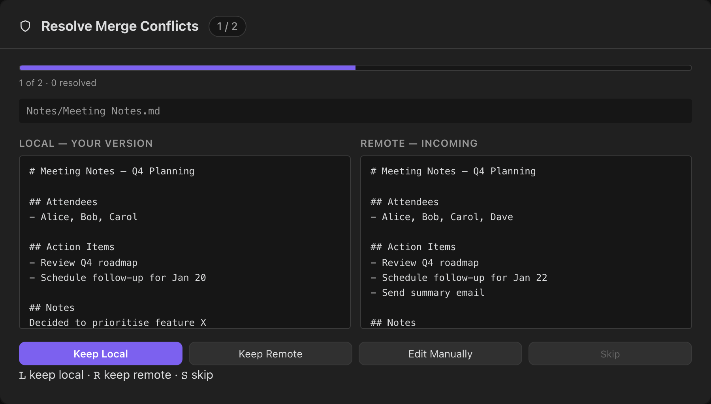

# Conflict Resolution

A conflict occurs when the same file has been modified both locally and on the remote since the last sync. Obsidian Git Vault detects conflicts automatically and gives you multiple strategies for resolving them.

---

## Conflict Detection

**Git Mode:** conflicts are detected by Git's merge algorithm. Files with merge conflicts are listed in the Source Control View with a warning indicator.

**Gitless Mode:** a conflict is declared when:

- The file exists in both local vault and remote repository, **and**
- The local content differs from the remote content, **and**
- The last sync time cannot definitively determine which version is newer (or the `manual` strategy is active)

---

## Automatic Strategies

Configure in **Settings → Obsidian Git Vault → Conflict Resolution Strategy**.

### `manual` _(default)_

No automatic resolution. Every conflict is queued for review in the Visual Conflict Resolver before anything is overwritten.

Best for: shared vaults, important documents, or any workflow where silent overwrites are unacceptable.

### `last-write-wins`

The version with the more recent modification time is kept. Local file `mtime` is compared against the last recorded sync timestamp to determine which side was modified after the last successful sync.

Best for: solo users on multiple devices where edits rarely overlap.

### `always-local`

Local changes always win. Remote changes are overwritten.

Best for: workflows where the local device is always the source of truth (e.g. a primary desktop with mobile read-only access).

### `always-remote`

Remote changes always win. Local changes are discarded.

Best for: pulling a canonical shared version maintained by another user or process.

## Visual Conflict Resolver

When `manual` strategy is active, or when you open the resolver directly, you see a side-by-side view for each conflicting file.

### Navigation

- A **progress bar** at the top shows how many of the N conflicts have been resolved so far.
- The header shows **"Resolve Merge Conflicts — filename (N of M)"** indicating your position in the queue.
- Text files show a **side-by-side diff**: _Local — your version_ on the left, _Remote — incoming_ on the right.
- Binary files and delete conflicts show a single-panel notice instead of a diff.
- Use the action buttons (or keyboard shortcuts — see below) to resolve each file in turn.
- Resolutions are accumulated in memory; nothing is written until you click **Apply Resolutions**.

### Actions

| Button            | Keyboard | Behaviour                                                                                |
| ----------------- | -------- | ---------------------------------------------------------------------------------------- |
| **Keep Local**    | `L`      | Discards the remote version; stages / uploads the local file                             |
| **Keep Remote**   | `R`      | Discards local changes; writes the remote content to the local vault                     |
| **Edit Manually** | —        | Opens a text editor pre-filled with the local content; click again to confirm your edits |
| **Skip**          | `S`      | Defers this file; it remains unresolved until the next sync cycle                        |

> **Keyboard shortcuts** — while the resolver is open, press `L`, `R`, or `S` to trigger the corresponding action without using the mouse. Shortcuts are suppressed when a text area inside the modal has focus (e.g. during manual editing).

### Applying Resolutions

After reviewing all conflicts, a summary screen lists your choices. Click **Apply Resolutions** to write all decisions atomically. The plugin then:

1. For each Keep Local → stages / uploads the local file
2. For each Keep Remote → writes the remote content to the local vault
3. For each manual edit → writes your edited content and stages / uploads it
4. Clears the conflict queue in SyncState

---

## Accessing the Resolver

- **From Simple Mode panel:** the "Resolve N Conflicts" button appears automatically when conflicts exist
- **From the Command Palette:** `Git Vault: Resolve conflicts`
- **From the Source Control View (Advanced Mode):** conflicted files are shown with a ⚠ indicator; click to open the resolver for that file

---

## Preventing Conflicts

- **Enable Smart Triggers** so your vault syncs frequently — this minimises the window for divergent edits
- **Use `manual`** as the safest default when you do not want silent overwrites
- **Use `last-write-wins`** only when you accept automatic conflict resolution
- Sync before starting a long writing session and after finishing it
