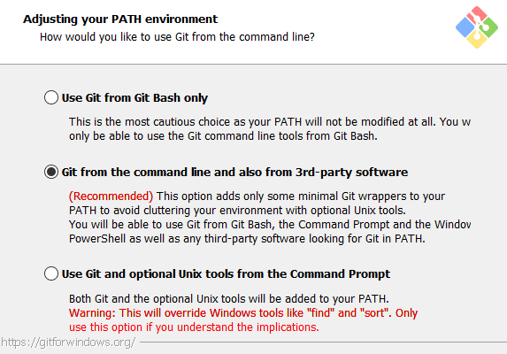

---
aliases:
    - 02 Installation
---

# Installation

Install both the Obsidian plugin and, when using Git Mode, a working Git binary that Obsidian can access.

> [!important]
> The plugin is cross-platform, but Git Mode depends on the host operating system exposing `git` to Obsidian. If Obsidian cannot see your Git installation, sync commands will fail even when Git works in your terminal.

## Plugin Installation

### From Obsidian

1. Open **Settings -> Community plugins**.
2. Select **Browse**.
3. Search for **Obsidian Git Vault**.
4. Install and enable the plugin.

### Manual Installation

1. Download `git-vault-<latest-version>.zip` from the [latest release](https://github.com/redoracle/obsidian-git-vault/releases/latest).
2. Unpack the zip into `<vault>/.obsidian/plugins/git-vault`.
3. Restart Obsidian.
4. Open **Settings -> Community plugins** and disable restricted mode if needed.
5. Enable **Obsidian Git Vault**.

## Windows

Installing [GitHub Desktop](https://github.com/apps/desktop) is not enough. Git Mode needs regular Git for Windows.

1. Install Git from the official [Git for Windows download page](https://git-scm.com/download/win).
2. Use Git 2.29 or newer.
3. Keep the default options unless you have a specific reason to change them.
4. Make sure Git is available to third-party software.



Git Credential Manager is installed with current Git for Windows releases. Verify it from a terminal:

```bash
git config credential.helper
```

Expected output:

```text
manager
```

If it is not configured, run:

```bash
git config --global credential.helper manager
```

Complete one authenticated Git action, such as clone, pull, or push, so Git Credential Manager can store your credentials.

## Linux

### Obsidian Package Choice

Known supported Obsidian installation methods:

- AppImage

Known problematic package formats:

- Snap: sandboxing can prevent Obsidian from accessing Git.
- Flatpak: Git access and filesystem access can be restricted, so it is not recommended for Git Mode.

If an older Flatpak installation is already broken, reset its overrides and update it:

```bash
flatpak update md.obsidian.Obsidian
flatpak override --reset md.obsidian.Obsidian
flatpak run md.obsidian.Obsidian
```

Source: [Flathub Obsidian issue](https://github.com/flathub/md.obsidian.Obsidian/issues/5#issuecomment-736974662)

### Git

Install Git from your distribution package manager. Examples:

```bash
# Debian / Ubuntu
sudo apt install git

# Fedora
sudo dnf install git

# Arch
sudo pacman -S git
```

Confirm Obsidian can find the same Git binary. If Git works in your terminal but not in Obsidian, add the directory returned by `which git` to **Settings -> Obsidian Git Vault -> Advanced -> Additional PATH environment variable paths**.

## macOS

### Git

Install Git using one of the methods from the [official Git macOS installation guide](https://git-scm.com/install/mac).

Common options:

- Xcode Command Line Tools: `xcode-select --install`
- Homebrew: `brew install git`

If Git is installed through Homebrew, Obsidian may not inherit `/opt/homebrew/bin` or `/usr/local/bin`. Add the relevant directory to **Settings -> Obsidian Git Vault -> Advanced -> Additional PATH environment variable paths** if needed.

### Keychain

Configure the macOS keychain credential helper:

```zsh
git config --global credential.helper osxkeychain
```

Complete one authenticated Git action, such as clone, pull, or push, after setting the helper. After that, Obsidian should be able to use the stored credentials.
